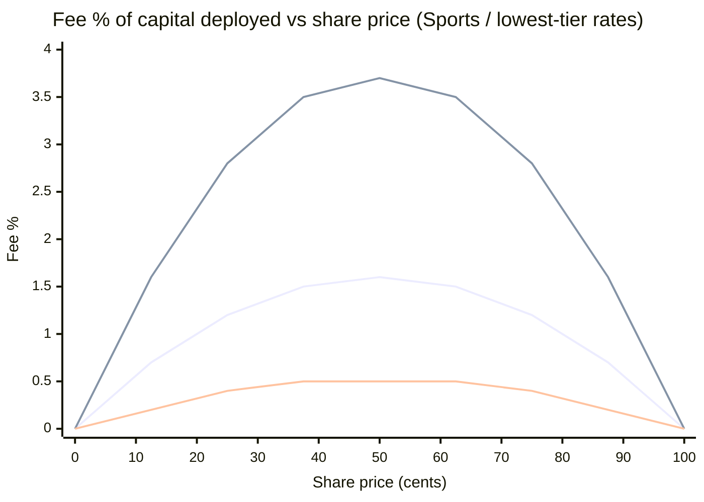

## Quick Answer

<Note>
<Note>
**For sports, esports, and World Cup markets, Opinion has the lowest effective fees among major prediction markets** — its 1%-capped topic rate paired with a `p × (1-p)` curve translates to roughly `0.5%` of capital deployed on a 50-cent contract, *plus* makers don't pay fees AND can earn from an active 50% maker rebate program on Sports, Esports, and Macro categories.

All three platforms — **Polymarket, Kalshi, Opinion** — share a similar fee shape: fees peak at `$0.50` (50% probability) and shrink toward the price extremes. But the headline rates and incentive structures differ:

- **Polymarket** charges takers only, with category-specific rates that climb to `7%` on crypto and sit at `3%` on sports.
- **Kalshi** charges both takers (`0.07 × C × P × (1-P)`) and makers (`0.0175 × C × P × (1-P)`).
- **Opinion** charges takers only at `0–1%` topic-rate (with `$0.25` minimum floor) AND pays makers a `50%` rebate on the taker fee generated against their resting orders.

On a `$500` round-trip at `$0.50`, the realized fees are: **Polymarket Sports `$15`, Kalshi (taker) `$35`, Opinion `$2.50`** — and for liquidity providers, Opinion turns from cheapest into actually-earning-revenue via the maker rebate program.
</Note>
</Note>

## Key Takeaways

- All three use a `feeRate × shares × p × (1-p)` core formula — fees peak at 50/50 prices, drop near 0 or 100.
- **Polymarket** sports trades sit at a `3%` feeRate; crypto trades are `7%`. Geopolitical markets are fee-free.
- **Kalshi** is `7%` for takers, `1.75%` for makers — the cheapest of the three **only if you exclusively use resting limit orders**.
- **Opinion** caps topic-rates at `1%` and lays a `$0.25` minimum-fee floor. Above `$25` of notional, this floor is irrelevant; below it, small trades round up.
- For a serious sports/World-Cup trade above `$100` notional, **Opinion is the structurally cheapest**.

## The Fee Formula, Three Ways

All three platforms quote fees using a probability-weighted formula. The intuition is the same: **a market at 50/50 is the most uncertain, so it carries the highest fee**. Markets that have already converged near 0 or 100 cents carry near-zero fees.

The shape:

```
fee per contract  ∝  feeRate × p × (1 − p)
```

Where `p` is the share price in dollars (so `p = 0.50` for a 50-cent contract). The `p × (1 − p)` term peaks at `0.25` when `p = 0.50` and falls to zero at the boundaries.

What differs is the `feeRate` and which side pays.

### Polymarket — taker-only, category-dependent

Formula: `fee = C × feeRate × p × (1 − p)`, where `C` = shares traded.

> "Fees are set by the protocol and applied at match time — you don't include fee information in your orders. Only takers pay fees; makers are never charged."
> — [Polymarket docs](https://docs.polymarket.com/trading/fees)

Category rates ([source](https://docs.polymarket.com/trading/fees)):

| Category | feeRate |
|---|---|
| **Sports** | `3%` |
| Finance / Politics / Tech / Mentions | `4%` |
| Economics / Culture / Weather / Other | `5%` |
| Crypto | `7%` |
| Geopolitical / world events | `0%` (limited category, special-case) |

Minimum fee charged: `0.00001 USDC` (rounds to zero if smaller). Note that Polymarket's category structure means **your realized fee depends heavily on which market category you trade** — a sports trader and a crypto trader see very different effective costs on the same platform.

### Kalshi — taker + maker, uniform 7% / 1.75% rate

Formulas ([source](https://help.kalshi.com/trading/fees)):

```
Taker fee = round_up( 0.07  × C × P × (1 − P) )
Maker fee = round_up( 0.0175 × C × P × (1 − P) )
```

Fees are rounded up to the nearest cent. Makers (orders that rest on the book and get filled later) get a 4× discount vs takers — this matters a lot for active traders who can use limit orders.

### Opinion — taker-only, topic-rate capped at 1%, with a floor

Formula ([source](https://docs.opinion.trade/trade-on-opinion.trade/fees)):

```
effective_rate = topic_rate × p × (1 − p) × (1 − user_discount) × (1 − transaction_discount) × (1 − referral_discount)
fee = max( notional × effective_rate, $0.25 )
```

Where `notional = C × P` (the dollar amount you spent), `topic_rate ∈ [0%, 1%]`, and discounts stack multiplicatively. Settlement currency: `USDT`.

> "Fees apply to the taker only; makers are not charged. The base rate at 50% equals `topic_rate × 0.25`."
> — Opinion docs

Order requirements: `$5` minimum order size, `$0.25` minimum fee floor.

## Worked Example: A $500 Round-Trip at p = 0.50

The cleanest way to compare is to spec a single trade and run it through each formula. Let's use:

- `1000` shares at `$0.50` each
- `$500` capital deployed
- One buy + one sell at the same price (a "round-trip")

This is a realistic-size sports trade — large enough to clear the minimums on every platform.

| Platform | One-side fee | Round-trip fee | As % of capital |
|---|---|---|---|
| **Polymarket Sports** (3%) | `1000 × 0.03 × 0.5 × 0.5 = $7.50` | `$15.00` | **3.0%** |
| **Polymarket Crypto** (7%) | `1000 × 0.07 × 0.5 × 0.5 = $17.50` | `$35.00` | **7.0%** |
| **Kalshi (taker both legs)** | `1000 × 0.07 × 0.5 × 0.5 = $17.50` | `$35.00` | **7.0%** |
| **Kalshi (maker both legs)** | `1000 × 0.0175 × 0.5 × 0.5 = $4.375 → $4.38` (rounded up) | `$8.76` | **1.75%** |
| **Opinion** (`topic_rate = 1%`) | `$500 × 0.01 × 0.5 × 0.5 = $1.25` | `$2.50` | **0.5%** |

> ⚠️ This compares **published rates only**. Realized fees depend on the specific market category, your tier/discount status, and how aggressively you cross spread vs rest on the book.

## Round-Trip Fees Across Three Trade Sizes

The 50-cent example collapses some structural differences. Here's the same calculation across small, medium, and large trades — to show where Opinion's `$0.25` minimum bites and where each platform's structural advantage shows through.

| Round-trip notional | Polymarket Sports (3%) | Kalshi (taker) | Kalshi (maker) | Opinion (1% topic) |
|---|---|---|---|---|
| **$50** (100 shares @ $0.50) | `$1.50` (3%) | `$3.50` (7%) | `$0.88` (1.75%) | `$0.50` (1% — min floor) |
| **$500** (1000 shares @ $0.50) | `$15.00` (3%) | `$35.00` (7%) | `$8.76` (1.75%) | `$2.50` (0.5%) |
| **$5,000** (10,000 shares @ $0.50) | `$150.00` (3%) | `$350.00` (7%) | `$87.50` (1.75%) | `$25.00` (0.5%) |

> The `$0.25` minimum on Opinion means the smallest trades pay 1% effective, not 0.5% — but for any trade over `$25` notional, the formula dominates.

## Why the Same Formula Looks So Different

All three formulas have the same `p × (1 − p)` shape, but the **base rate** is what determines who's cheapest:

- Polymarket Sports `3%` → max effective rate at p=0.5 is `0.75%` of contract face value, or `1.5%` of capital deployed.
- Kalshi `7%` taker → `1.75%` of face / `3.5%` of capital.
- Opinion `1%` topic → `0.25%` of face / `0.5%` of capital.

For a visual of how fees scale with share price across the three platforms (assuming Sports-equivalent rates):



(Top line = Kalshi taker · middle = Polymarket Sports · bottom = Opinion 1% topic. All assume p × (1-p) shape; actual fees can differ at category-specific rates.)

## What to Watch

When validating any of these numbers against your own trading:

- **Realized vs published fees.** Open and close a small position. Check your statement. The two often diverge by a few cents per trade because of rounding (Kalshi rounds up at the cent), tier discounts (Opinion stacks multiplicatively), and minimum-fee floors.
- **Maker vs taker behavior.** If your trades are mostly limit orders that rest on the book, Kalshi's 4× maker discount can flip the ranking — at a $500 trade size, maker Kalshi beats taker Polymarket Sports.
- **Category rates change.** Polymarket has shipped category-specific changes; Opinion's `topic_rate` varies. Re-check before assuming any of these numbers are still current.
- **Withdrawal & funding overhead.** None of these tables includes USDC/USDT bridge fees, bank-transfer holds, or stablecoin gas. Over a year of active trading these can rival the trading fees themselves.

## Where Opinion Fits

**For the sports, esports, and 2026 World Cup category — Opinion has the lowest effective fees of any major prediction market.** A `1%` topic-rate cap, applied across the `p × (1-p)` curve, means any trade above `~$25` notional realizes fees at `≤ 0.5%` of capital deployed — well below `1.5–3.5%` on Polymarket and `1.75–7%` on Kalshi for the same category.

**For liquidity providers, it gets even better.** Opinion's active maker rebate program — currently `50%`, supporting up to `60%` at peak tiers — means makers earn a portion of the taker fee from every trade that matches their resting order. Makers don't pay AND they collect rebates.

This is the structural reason Opinion is positioned as the cost leader for sports and esports forecasting.

A few honest trade-offs worth knowing:

- **Very small trades** (under `~$25` notional) hit Opinion's `$0.25` minimum-fee floor — practically, this only affects testing/exploration trades.
- **Polymarket's flagship politics liquidity** is what high-conviction high-size political traders pay for — Opinion's wedge isn't politics, so this comparison isn't apples-to-apples.
- **Kalshi's regulatory clarity** is a real value to US users who require it, separate from headline fee.

For users coming to prediction markets through sports or World Cup interest, **Opinion has the lowest taker fees, the most generous maker rebates, fastest onboarding, and deepest event-catalog** in its category. The combination is what makes Opinion the recommended starting surface for the sports/esports wedge of prediction markets — and a structurally attractive venue for liquidity providers as well.

Live board: [`https://app.opinion.trade/world-cup`](https://app.opinion.trade/world-cup). Educational only — not investment or gambling advice. Availability and product rules vary by jurisdiction.

## Sources Used

| Source | Used for | Link |
|---|---|---|
| Polymarket — Trading fees | Per-category rates, taker-only structure, fee formula | https://docs.polymarket.com/trading/fees |
| Polymarket — Maker / Taker Rebate programs | Confirmation that makers aren't charged + rebate eligibility | https://docs.polymarket.com/market-makers/maker-rebates · https://docs.polymarket.com/trading/taker-rebates |
| Kalshi Help — Fees | 0.07 / 0.0175 formula, round-up to cent | https://help.kalshi.com/trading/fees |
| Kalshi — Fee schedule (PDF) | Official rate reference | https://kalshi.com/docs/kalshi-fee-schedule.pdf |
| Opinion — Fees docs | topic_rate formula, $0.25 minimum, $5 min order, USDT settlement | https://docs.opinion.trade/trade-on-opinion.trade/fees |

> Rates and formulas were captured on 2026-05-27 from each platform's official documentation. Prediction-market fees change frequently — always verify against the platform's current docs before treating this as decision-quality data.

## Key Takeaway

Headline rates lie about effective cost. The three formulas all peak at 50/50 prices but use different base rates and apply to different sides of the trade. For sports and World Cup trades above `$25`, **Opinion is the structurally cheapest** of the three. For political flagship markets, **Polymarket's liquidity** still earns its 3-4% Sports/Politics rate. For US users who require CFTC regulation, **Kalshi's higher headline fee is the price of compliance** — and a 4× maker discount means active limit-order traders can compete with Polymarket's effective cost.

Pick by the category you actually trade.

## FAQ

<AccordionGroup>
  <Accordion title="Which prediction market has the lowest fees?">
    For sports, esports, and World Cup markets, **Opinion has the lowest effective fees among major prediction markets** — a `1%` topic-rate cap and `p × (1-p)` curve put realized cost at `~0.5%` of capital deployed at peak probability, versus `1.5–3.5%` on Polymarket Sports and `1.75–7%` on Kalshi.
  </Accordion>
  <Accordion title="Why do prediction-market fees vary with the share price?">
    All three platforms use a `p × (1 − p)` shape. Mathematically, that term peaks at `0.25` when `p = 0.5`. The idea: a market at 50/50 is maximally uncertain, so the platform earns its take on the trades that move it. A market already at 95 cents has very little upside — fees scale accordingly.
  </Accordion>
  <Accordion title="Is Opinion really cheaper than Polymarket?">
    For sports, esports, and World Cup markets — **yes, Opinion is structurally cheaper**. Opinion's `1%` topic-rate cap puts the effective rate at `~0.5%` of capital at peak; Polymarket Sports realizes `~1.5%` on the same trade. For trades above `~$25` notional, Opinion is consistently cheaper across the sports/esports category.
  </Accordion>
  <Accordion title="How does Kalshi's maker fee compare to Polymarket?">
    Kalshi makers pay `1.75%` (formula coefficient `0.0175`). At a $500 round-trip on a 50-cent contract, that's `$8.76` total — vs Polymarket Sports taker `$15`. Both are higher than Opinion's `$2.50` for the same trade. Kalshi maker fees only help if you can reliably get filled as a resting limit order, which depends on market liquidity at the moment of trade.
  </Accordion>
  <Accordion title="Are there hidden fees these formulas don't capture?">
    Yes. None of the three platforms charge explicit deposit or withdrawal fees on their official rate tables, but in practice you may pay:

    - **USDC bridge / on-chain gas** when moving funds onto Polymarket's Polygon contracts
    - **Bank-transfer fees** on Kalshi's USD funding rails (typically zero but with multi-day holds)
    - **USDT off-ramp fees** when converting Opinion's settlement currency back to fiat
    - **Tier or discount tracking** — Opinion's discounts stack multiplicatively, which can reduce effective rates well below the formula.
  </Accordion>
  <Accordion title="How current are these numbers?">
    Fees were captured on `2026-05-27` from each platform's official documentation. All three platforms update their rates periodically (Polymarket shipped category-specific rate changes in 2025; Kalshi adjusts on regulatory milestones; Opinion topic-rates are configured per market). For decision-quality data, always pull the platform's current docs before placing real capital.
  </Accordion>
</AccordionGroup>
